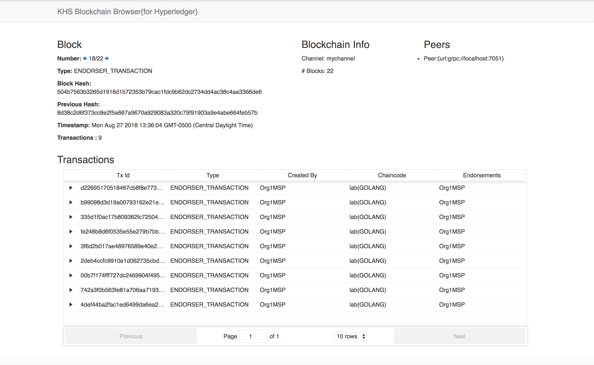
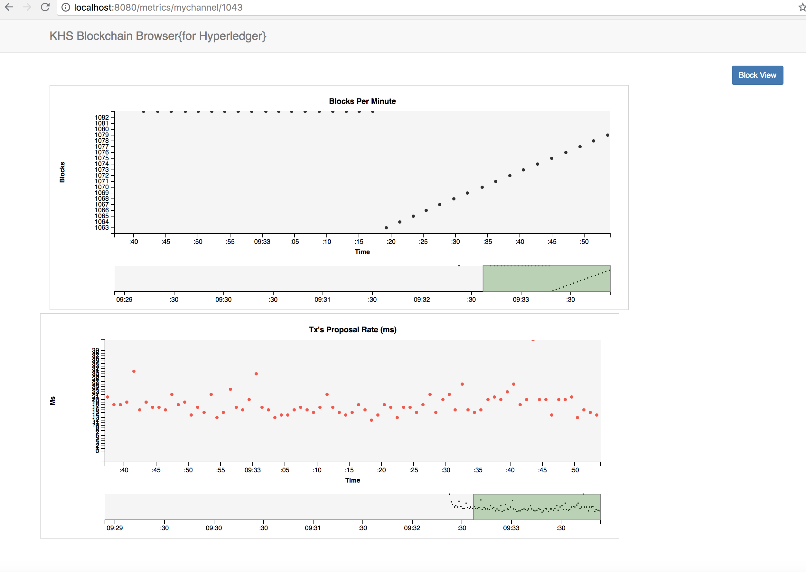
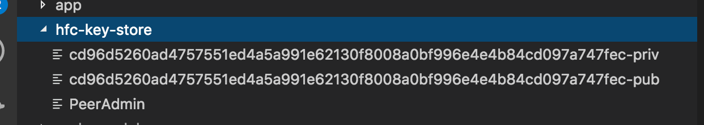

# khs-blockchain-browser

The KHS Blockchain Browser is an open source analytics tool that gives developers and operators of Hyperledger blockchain networks real-time visibility into transactions and blocks as they are added to a HLF network. 

Blockchain Browser is a React/Node.js web application with which a persistent database is not required. The Blockchain Browser "browses" the block store directly using the Fabric Node.js SDK. 

#### View a three-minute video of the Blockchain Browser in action [here](https://youtu.be/yu96eA8GstQ).

#### Give a LIVE version a try, here's a link to a browser deployed to Heroku and pointing to a reference Hyperledger Fabric reference network [here](https://byzantine-browser.herokuapp.com)

Please see below for installation and startup instructions. 

## Screenshots 

#### Real-time Block Information



#### Real-time Blockchain Metrics



## Requirements
* [Node](https://nodejs.org/en/download/) 8.9.x or above
* `Windows OS Only` - [Python](https://www.python.org/downloads/) 2.7+ (v3+ not supported)
* `Windows OS Only` - For 'rm' and 'cp' commands, use Powershell or add Git to PATH (C:\Program Files\Git\usr\bin) or install Cygwin.
* Access to HyperLedger Fabric network. Here's an example: [khs-lab-results-blockchain](https://github.com/in-the-keyhole/khs-lab-results-blockchain)

Note: Two useful tools for managing Node and Python versions are [nvm](https://github.com/creationix/nvm) and [pyenv](https://github.com/pyenv/pyenv).

## Installation

1. Clone repo
2. Install server and UI JavaScript modules

```bash
    $ npm install
    $ cd ui
    $ npm install
    $ cd ..
```

3. The current keystore has credentials for the Hyperledger example networks. You can access other networks by modifying the `config.js` so that the `network_url` property points to a peer node address and an admin `USERID` property references an admin user and public/private keys located in the `hfc-key-store` folder.

```javascript
    module.exports = {
        port: process.env.PORT || 4001,
        host: process.env.HOST || "localhost",
        loglevel: process.env.LOGLEVEL || "info",
        wallet_path: process.env.KEYSTORE || "../hfc-key-store",
        user_id: process.env.USERID || "PeerAdmin",
        network_url: process.env.NETWORK_URL || "grpc://localhost:7051",
        network_profile: process.env.NETWORKPROFILE || '',
        peer_pem: process.env.PEER_PEM || ''
    }
```

Here is an example public/private and user file in the `hfc-key-store` directory. 



The server startup script copies credentials from the `wallet-path` config.js `hfc-key-store` value to the users home `~/hfc-key-store` directory. Make sure the user home directory is writable.

Access credentials are created for a network by enrolling a user here's a [LINK](https://hlf.readthedocs.io/en/v1.1.0/write_first_app.html) describing how a user can be enrolled and credentials generated.  Go to the `Enroll the Admin User` section.

4. Start the API Server and UI server with the following commands:

```
    $ ./runApiServer.sh 
    $ npm run start:dev 
```

5. Browse to [`http://localhost:8080`](http://localhost:8080).

Note: to change the port, edit file `./ui/package.json`.

### Using TLS

These three variables are used to enable TLS with the targeted peer (put them in a `.env` file in the root and replace the values for your network's):

```bash
NETWORKPROFILE=../connection/networkprofile.json
PEER_PEM=-----BEGIN CERTIFICATE-----\nMIICb...
SSL_TARGET_NAME_OVERRIDE=peer1...
```

Be sure to also replace the files in the folder `./hfc-key-store` with your keys.

## Feedback

Please let us know if you have questions - asktheteam@keyholesoftware.com. 

We at [Keyhole](https://keyholesoftware.com) are working to add new features all the time and would love your feedback.
